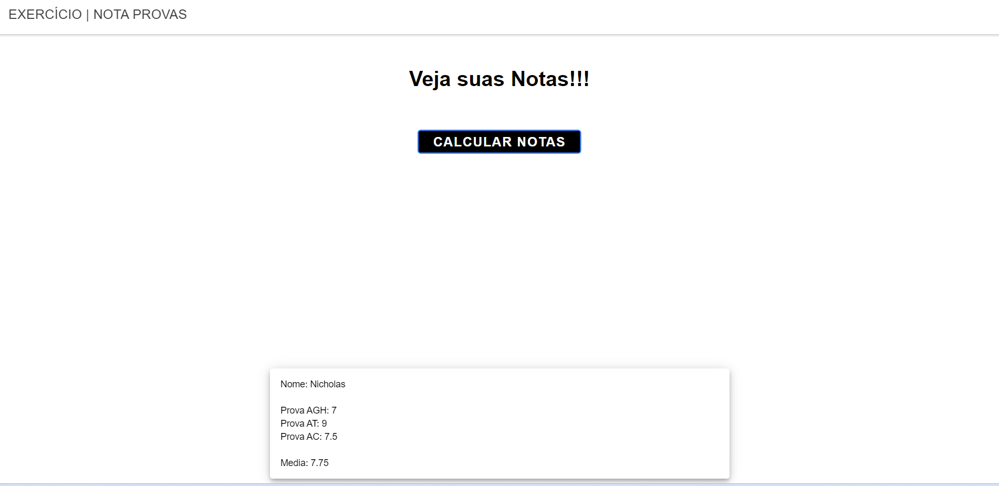

<h1 align="center"> Projeto Nota-Provas (Angular) </h1>

Projeto em Angular de Conversor Dólar-Real

---

 

  

---
## 💻 Tecnologias

Esse projeto foi desenvolvido com as seguintes tecnologias:

- Angular
- Ferramenta StackBlitz
- HTML5
- CSS3

---

## 🚧 Projeto

Projeto criado em Angular e Typescript pelo curso Técnico Desenvolvimento de Sistemas pela Etec Albert Einstein.
O usuário consegue entrar com 3 Notas de Provas diferentes e verificar sua Média Final.
Cada Prova tem um peso diferente, sendo a Primeira com menor peso (Peso 1), e a última com maior peso (Peso 7)
O programa feito está em: src/app/ app.component.ts e app.component.html e app.component.css

Você pode ver o site neste link: [Projeto Nota-Provas](https://stackblitz.com/edit/ionic6-angular13-fnmga5)

--- 
